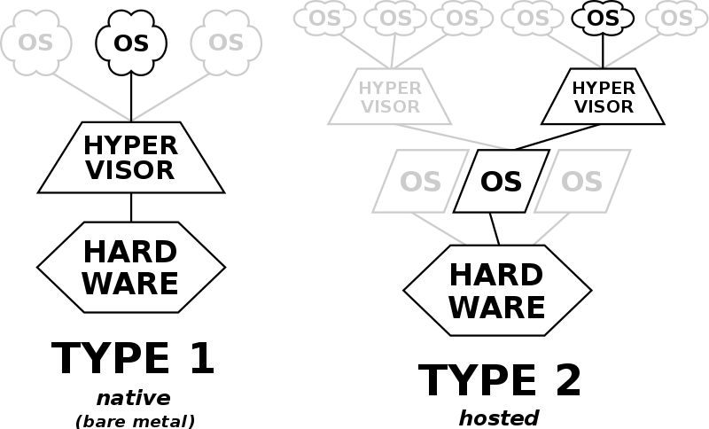

Title: 102.6 Linux as a virtualization guest
Date: 2010-12-03 10:20
Category: LPIC1
Tags: LPIC1, 101, LPIC1-101-500
Authors: Jadi
Summary: Candidates should understand the implications of virtualization and cloud computing on a Linux guest system.
sortorder: 110

*Weight: 1*

Candidates should understand the implications of virtualization and cloud computing on a Linux guest system.

## Key Knowledge Areas

- Understand the general concept of virtual machines and containers
- Understand common elements of virtual machines in an IaaS cloud, such as computing instances, block storage and networking
- Understand the unique properties of a Linux system which have to be changed when a system is cloned or used as a template
- Understand how system images are used to deploy virtual machines, cloud instances and containers
- Understand Linux extensions that integrate Linux with a virtualization product.
Awareness of cloud-init

### Terms
- Virtual machine
- Linux container
- Application container
- Guest drivers
- SSH host keys
- D-Bus machine id

<iframe width="560" height="315" src="https://www.youtube.com/embed/F3yl5Lx1htc" title="YouTube video player" frameborder="0" allow="accelerometer; autoplay; clipboard-write; encrypted-media; gyroscope; picture-in-picture" allowfullscreen></iframe>

## Introduction
Virtual machines (VMs) are *simulated* computers. You can use Virtual Machines to create new computers on top of your running machine and install new OSs there. In some cases, it's also possible to run only parts of an OS on top of the current OS; This is called having containers. 

To run virtual machines, we need **Hypervisor** software (also called Virtual Machine Managers (VMM)). We have two types of hypervisors.

To check and see if your host operating system / CPU, supports using hypervisors check for the `vmx` (for Intel CPUs) or `svm` (for AMD CPUs) in your `/proc/cpuinfo` in flags. 

> You may need to turn the hypervisor option On using your BIOS or UEFI.

Based on your CPU you should have `kvm` or `kvm-amd` kernel modules loaded. 

```
lsmod | grep -i kvm
sudo modprobe kvm
```

> If you see `hypervisor` in your `/proc/cpuinfo` it means that you are inside a virtualized linux machine :)

Now, let's see the 2 types of hypervisors. First type 2, since it's easier to understand. 


### Type 2 Hypervisor
These hypervisors run on a conventional operating system (OS) just as other computer programs do. A guest operating system runs as a process on the host. Type-2 hypervisors abstract guest operating systems from the host operating system.

In other words, a type 2 hypervisor is the software between the guest and host. It completely runs on the host OS and provides virtualization to the guest. 

Two of the most famous Type 2 hypervisors are VirtualBox (from Oracle) and VMware.

### Type 1 Hypervisor
These hypervisors run directly on the host's hardware to control the hardware and manage guest operating systems. For this reason, they are sometimes called bare-metal hypervisors. The first hypervisors, which IBM developed in the 1960s, were native hypervisors. These included the test software SIMMON and the CP/CMS operating system, the predecessor of IBM z/VM.


Some of the most famous Type 1 hypervisors are KVM, Xen & Hyper-V. **KVM** is built-in since Linux Kernel version 2.6.20. 
## Creating a Virtual Machine
First, create the machine itself. We tell the hypervisor this machine how much RAM/disk/CPU/... needs and set a name for our machine. Then we need to *install* the guest OS. This can be done using:

- Installing from a CD / DVD / ... 
- **Cloning** an existing machine
- Using **Open Virtualization Format (OVF)** to move machines between hypervisors. This is a standard format for virtual machine definition and may include several files, in this case, you can archive all of them into one **Open Virtualization Archive (OVA)** file.
- It is also possible to create **Templates** that are _master copies_* to initiate new machines

> You may need to install some *guest drivers* or *additions* to help your hypervisor to have a better control on your guest machine. These might include graphical drivers for virtualbox or scripts to help vmware to control a guest machine or check its status. 

## Guest specific configs
Some configurations are machine specific. For example, a network card's MAC address should be unique for whole the network. If we are cloning a machine or sometimes creating them from templates, at least we need to change these on each machine before booting them:

- Host Name
- NIC MAC Address
- NIC IP (If not using DHCP)
- Machine ID (delete the `/etc/machine-id` and `/var/lib/dbus/machine-id` and run `dbus-uuidgen --ensure`. These two files might be soft links to each other)
- Encryption Keys like SSH Fingerprints and PGP keys
- HDD UUIDs
- Any other UUIDs on the system

> Some configs might be empty on templates, do not forget to fill them too.


## Containers


In previous sections, we were dealing with complete guest OSs. But is also possible to virtualize only parts of an OS; This is called OS-level virtualization. 

OS-level virtualization is an operating system (OS) paradigm in which the kernel allows the existence of multiple isolated user space instances, called containers. 

This can be done to run an application or a service or even run most parts of a new OS for test purposes. 

## IaaS
As the name implies, **Infrastructure as a Service** or IaaS means offloading parts of your infrastructure to other companies. This means buying *services* like electricity, cooling and even running hypervisors to another company and just rent your VirtualMachine from them. This makes your life easier because things like "Adding New Hards" now only mean paying a bit more for more HDD on your machine; Instead of buying HDDs and installing, ... This is called cloud! You might even be able to move your machine from one continent to another one just with one click. 

Samples of these cloud providers are [Amazon Web Services][1] , [Google Cloud Platform][2] and [Microsoft Azure][3].

Different cloud providers might provide different levels of Infrastructure or services. These are some examples:

- Load Balancing: Distribute incoming requests between your servers
- Block Storage: Providing disks to be configured by you and added to your machines
- Object Storage: Lets you store your data directly; Say for photos
- Elasticity: Lets you configure an automated increase/decrease in your service capacity based on request volume
- SaaS: Software as a Service lets you use the software you need, on the Cloud as a Service. Think of having an online office suite for your company without installing anything on your workstations.

There are programs like `cloud-init` which help you initialize your cloud machine with ease. This service can help you start machines based on templates on AWS, Azure, Digital Ocean and others with ease.

[1]:(https://aws.amazon.com/)
[2]:(https://cloud.google.com/)
[3]:(https://azure.microsoft.com/en-us/)
